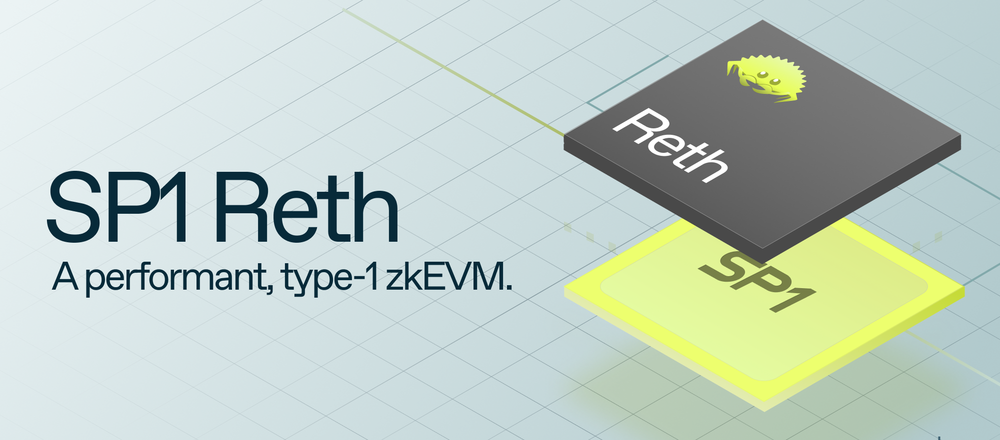

# SP1 Reth

[![Telegram Chat][tg-badge]][tg-url]

[tg-badge]: https://img.shields.io/endpoint?color=neon&logo=telegram&label=chat&url=https://tg.sumanjay.workers.dev/succinct_sp1
[tg-url]: https://t.me/succinct_sp1



SP1 Reth is a 100% open-source POC that showcases how any rollup can use SP1 to build a performant (type-1, bytecode compatible) ZK-EVM with less than 2000 lines of maintainable Rust code. SP1 Reth achieves incredible performance (around $0.01-0.02 proving cost for an average Ethereum transaction)  by leveraging SP1’s open-source, customizable precompile system, with orders of magnitude improvements to come. SP1 Reth points to a future where all rollups can become ZK rollups, utilizing the magic of ZKPs with maintainable software written in Rust.

[Blog Post](https://blog.succinct.xyz/sp1-reth) | [SP1 Repo](https://github.com/succinctlabs/sp1) | [SP1 Docs](https://succinctlabs.github.io/sp1/)

## Requirements

To reproduce the benchmarks in our blog post, your system will need:

- 64+ CPUs
- 512+ GB RAM
- NVME Hard Drive

We ran our benchmarks on a i4g.16xlarge instance on AWS. You may need to add a [swap file](https://phoenixnap.com/kb/linux-swap-file) on NVME.

## Run

Make sure you have mounted your NVME hard drive in a RAID0 setup with at `raid0` with a `tmp` folder.

```
cd script
TMPDIR=/mnt/raid0/tmp \
SHARD_SIZE=524288 \
RUST_LOG="debug,p3_keccak_air=off" \
RUSTFLAGS="-C target-cpu=native" \
cargo run --release -- \
  --rpc-url <rpc_url> \
  --block-number <block_number>
```

## Lines of Code

```
$ cloc --by-file --include-lang=Rust primitives program   
      10 text files.
       8 unique files.
       5 files ignored.

github.com/AlDanial/cloc v 1.96  T=0.01 s (707.0 files/s, 264169.2 lines/s)
------------------------------------------------------------------------------------------
File                                        blank        comment           code
------------------------------------------------------------------------------------------
primitives/src/mpt.rs                         124            272           1022
primitives/src/processor.rs                    43             56            316
primitives/src/alloy2reth.rs                    8              3            145
primitives/src/db.rs                           19             11            134
primitives/src/lib.rs                          15             17             24
program/src/main.rs                             6              5             22
------------------------------------------------------------------------------------------
SUM:                                          215            364           1663
------------------------------------------------------------------------------------------
```

## Security

This code has not yet been audited, and should not be used in any production systems.

## Acknowledgements

We would like to acknowledge the projects below whose previous work has been instrumental in making this project a reality:

- [Reth](https://github.com/paradigmxyz/reth): For providing an excellent execution client reference and primitives needed for processing blocks.
- [Revm](https://github.com/bluealloy/revm): For providing core execution primitives and a performant EVM implementation.
- [Alloy](https://github.com/alloy-rs/alloy): For providing core ethereum primitives and RPC methods.
- [Zeth](https://github.com/risc0/zeth): For providing a performant MPT library that can be compiled inside the zkVM and a reference for how to perform preflight/postflight execution logic. We chose to not fork Zeth directly because we noticed there was an opportunity to reuse significantly more code from Reth, Revm, and Alloy.